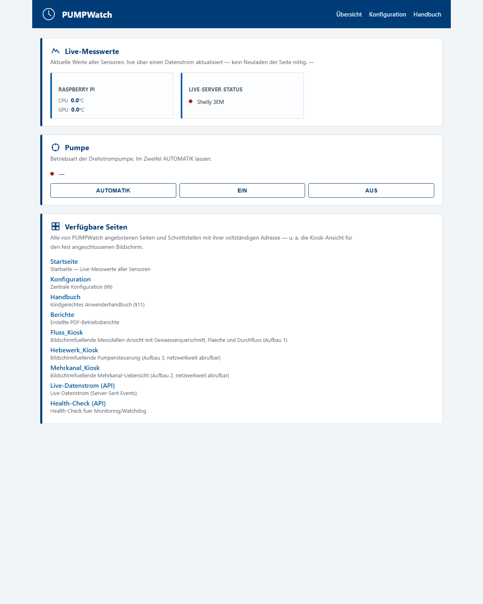
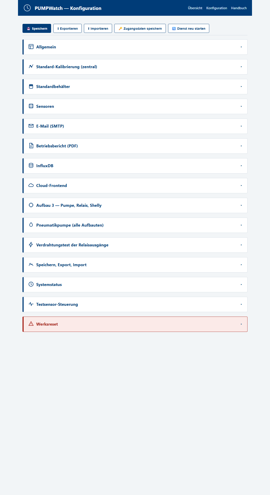
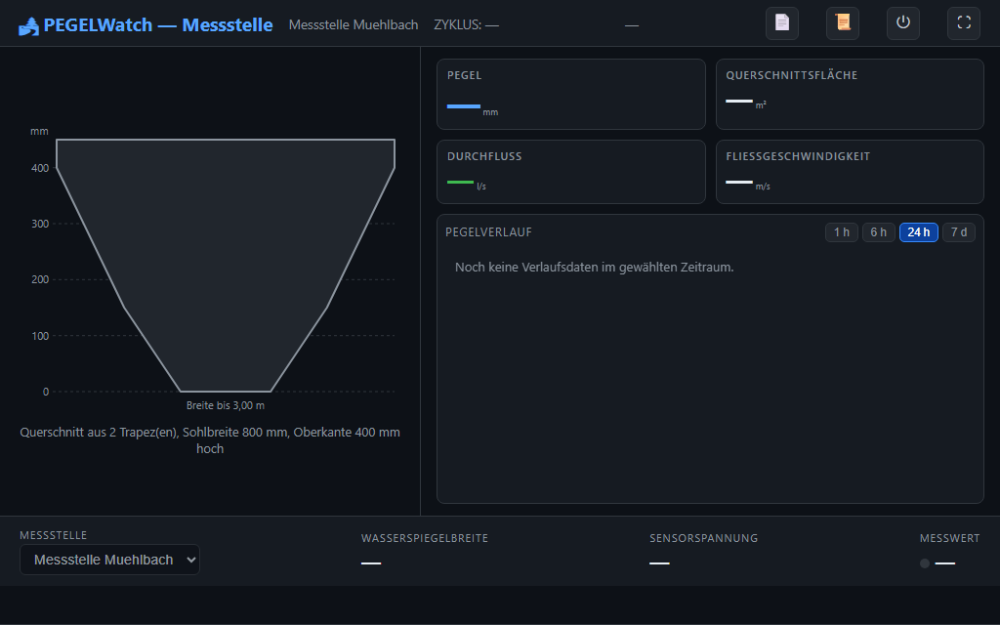
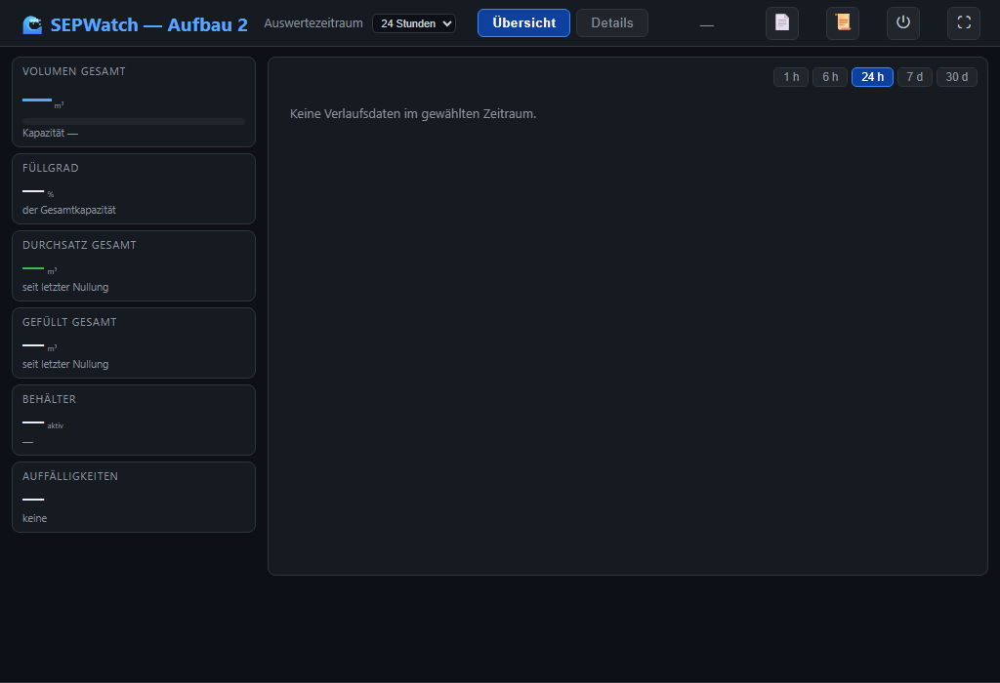
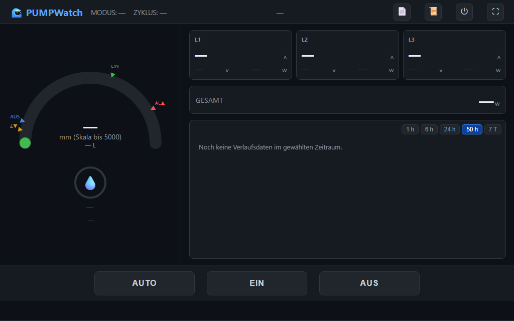

# PegelWatch — Handbuch für Betreiber

**Wasserstands-Messung und Pumpensteuerung auf dem Raspberry Pi —
vom Auspacken bis zum laufenden Betrieb**

Dieses Handbuch führt Sie Schritt für Schritt durch Einrichtung, Anschluss,
Inbetriebnahme, Bedienung und Wartung. Sie brauchen dafür **keine**
Programmierkenntnisse. Sie sollten einen Raspberry Pi mit Bildschirm und
Tastatur (oder per Fernzugriff) bedienen und einen Befehl ins Terminal
kopieren können.

> 💡 **So lesen Sie dieses Handbuch.**
> - Jeder **Handlungsschritt ist nummeriert** und endet mit einem
>   ✅ **Erfolgskriterium** — daran erkennen Sie, dass es geklappt hat.
> - ⚠️ markiert Gefahren oder möglichen Datenverlust, 💡 Tipps.
> - Finden Sie in [Kapitel 1](#1-welcher-aufbau-ist-meiner) heraus, **welcher
>   der drei Aufbauten Ihrer ist**. Danach gilt der gemeinsame Teil plus der
>   Abschnitt für genau Ihren Aufbau.

---

## Inhalt

1. [Welcher Aufbau ist meiner?](#1-welcher-aufbau-ist-meiner)
2. [Was Sie brauchen](#2-was-sie-brauchen)
3. [Den Raspberry Pi vorbereiten](#3-den-raspberry-pi-vorbereiten)
4. [PegelWatch installieren](#4-pegelwatch-installieren)
5. [Hardware anschließen](#5-hardware-anschließen)
6. [Der erste Start](#6-der-erste-start)
7. [Grundeinrichtung](#7-grundeinrichtung)
8. [Kalibrieren — der wichtigste Schritt](#8-kalibrieren--der-wichtigste-schritt)
9. [Ihren Aufbau bedienen](#9-ihren-aufbau-bedienen)
10. [Die Anzeigen](#10-die-anzeigen)
11. [Alarme und E-Mail](#11-alarme-und-e-mail)
12. [Berichte und Grafana](#12-berichte-und-grafana)
13. [Software-Updates](#13-software-updates)
14. [Datensicherung und Wartung](#14-datensicherung-und-wartung)
15. [Optional: Cloud-Frontend](#15-optional-cloud-frontend)
16. [Wenn etwas nicht geht](#16-wenn-etwas-nicht-geht)
17. [Glossar](#17-glossar)
18. [Spickzettel](#18-spickzettel)

---

## 1. Welcher Aufbau ist meiner?

Dieselbe Software bedient **drei Ausbaustufen**. Welche aktiv ist, stellen Sie
in der Weboberfläche ein; sie bestimmt auch den angezeigten Namen.

| Aufbau | Name | Das ist Ihrer, wenn … |
|:---:|---|---|
| **1** | **PEGELWatch** | Sie **einen** Behälter oder eine Messstelle an einem Bach haben und nur den Pegel (optional Volumen oder Durchfluss) ablesen wollen. Keine Pumpe. |
| **2** | **SEPWatch** | Sie **mehrere** Behälter gleichzeitig überwachen (Füllstand, Volumen, Durchsatz) und vor **Leckagen** gewarnt werden wollen. Pumpen sind extern. |
| **3** | **PUMPWatch** | Sie ein **Pumpwerk** mit einer **Drehstrompumpe** haben, die PegelWatch selbst ein- und ausschaltet — mit **Strommessung** (Shelly 3EM) und **Relaiskarte**. |

---

## 2. Was Sie brauchen

### 2.1 Lieferumfang und Eigenbeschaffung

| Teil | Woher | Hinweis |
|---|---|---|
| **Sensorplatine** mit AD-Wandler (ADS1115), gefilterter 5-V-Sensorversorgung und Drucksensor(en) MPXV5050DP | von Ihrem PegelWatch-Anbieter | bestückt und geprüft; Aufbau 2 ggf. mehrere Platinen |
| **Raspberry Pi 4 oder 5**, mind. 4 GB RAM | selbst | Pi 4 mit 2 GB geht nur eingeschränkt |
| **SD-Karte** (Typ A2, ab 32 GB) oder SSD | selbst | |
| **Netzteil** für den Pi (Original-Netzteil, 5,1 V) | selbst | ein schwaches Netzteil verursacht Messfehler; die Sensorplatine wird darüber mitversorgt |
| **Luftschlauch** (Silikon/PVC, 4 mm innen) und **Staudruckglocke** bzw. Tauchrohr | selbst oder Anbieter | Verbindung Messstelle ↔ Sensor, muss **luftdicht** sein |
| Netzwerk (LAN-Kabel oder WLAN) | vorhanden | Pi und Ihr PC/Handy im selben Netz |
| *optional* HDMI-Bildschirm 1024×600 | selbst | große Vollbild-Anzeige (Kiosk) |
| *optional* 7-Segment-Anzeige (MAX7219) | Anbieter/selbst | kleine rote Pegelanzeige |
| **Aufbau 3:** Waveshare **RPi Relay Board (B)** | selbst | 8-Kanal-Relaiskarte, wird auf den Pi gesteckt |
| **Aufbau 3:** **Shelly 3EM** | selbst | Strommessung der drei Phasen |
| **Aufbau 3:** Schütz und Motorschutzschalter | Elektrofachbetrieb | |

> ⚠️ **Netzspannung und Drehstrom nur durch eine Elektrofachkraft.** Aufbau 3
> schaltet eine echte Drehstrompumpe. Alles, was mit 230 V / 400 V zu tun hat,
> macht **ausschließlich eine ausgebildete Fachkraft**.

### 2.2 Werkzeug

Schraubendreher, Zollstock oder Maßband (zum Kalibrieren), ein Eimer oder der
Behälter selbst mit Wasser.

---

## 3. Den Raspberry Pi vorbereiten

1. Laden Sie den **Raspberry Pi Imager** von `raspberrypi.com` und schreiben
   Sie **Raspberry Pi OS (64-bit)** mit Desktop auf die SD-Karte.
   Mit Bildschirm am Pi: die Desktop-Version. Ohne Bildschirm genügt „Lite".
2. Stellen Sie im Imager unter **Einstellungen** ein:
   - einen **Benutzernamen** und ein **Passwort** (merken!),
   - **WLAN** (falls kein Kabel),
   - **SSH aktivieren** (Fernzugriff, praktisch für Wartung).
3. SD-Karte in den Pi, Netzwerk und Netzteil anschließen, einschalten.
   ✅ Der Pi startet und ist im Netzwerk. Seine **IP-Adresse** finden Sie im
   Router oder am Pi mit `hostname -I`.
4. **Nur beim Raspberry Pi 5:** Die Datenbank braucht den klassischen
   Speichermodus. Öffnen Sie ein Terminal am Pi (oder per SSH) und geben Sie ein:
   ```bash
   echo "kernel=kernel8.img" | sudo tee -a /boot/firmware/config.txt
   sudo reboot
   ```
   ✅ Nach dem Neustart zeigt `getconf PAGE_SIZE` den Wert **4096**.

---

## 4. PegelWatch installieren

Ein einziger Befehl richtet alles ein: die Diagramm-Anzeige **Grafana**, die
Verlaufs-Datenbank **InfluxDB 3**, die **signierte PegelWatch-Paketquelle**
und PegelWatch selbst.

1. Öffnen Sie ein Terminal — **als der Benutzer, der später am Bildschirm
   angemeldet ist** (wichtig für die Vollbild-Anzeige).
2. Geben Sie ein:
   ```bash
   curl -fsSL https://gsandreas.github.io/pegelwatch-dist/install.sh | sudo sh
   ```
3. Warten Sie, bis **„Fertig"** erscheint. Das dauert je nach Internet
   5–15 Minuten (das Betriebssystem wird dabei auch aktualisiert).
   ✅ Am Ende stehen die Versionsnummer, der Kanal und die Adresse der
   Konfigurationsseite.
4. Starten Sie den Pi einmal neu: `sudo reboot`
   (schaltet die Schnittstellen I²C und SPI endgültig ein).

**Optionen** (hinter `sudo sh -s --` anhängen):

| Option | Wirkung |
|---|---|
| `--channel daily` | Kanal **daily** statt **stable** (jeder neue Stand, für Testanlagen) |
| `--user NAME` | PegelWatch läuft als dieser Benutzer statt als Aufrufer |
| `--no-base` | Grafana und InfluxDB **nicht** installieren (nur PegelWatch) |

Beispiel: `curl -fsSL https://gsandreas.github.io/pegelwatch-dist/install.sh | sudo sh -s -- --channel daily`

> 💡 **Ist das sicher?** Das Skript prüft den **Signaturschlüssel** der
> Paketquelle (Fingerabdruck `811C 0B63 D3FB FEDA 059C 008F 5CFB FAA9 8605 8508`).
> Jedes Paket und jedes spätere Update wird von apt gegen diese Signatur
> geprüft. Den Inhalt des Skripts können Sie vorher ansehen:
> `curl -fsSL https://gsandreas.github.io/pegelwatch-dist/install.sh | less`

---

## 5. Hardware anschließen

> ⚠️ Schließen Sie alles bei **ausgeschaltetem** Pi an und prüfen Sie jede
> Leitung zweimal.

### 5.1 Sensorplatine an den Raspberry Pi

Die Sensorplatine wird über ihre Stiftleiste **J5** mit dem 40-poligen
Anschluss des Pi verbunden:

| Sensorplatine (J5) | Raspberry Pi | Pin |
|---|---|---|
| +5 V | 5 V | **Pin 2** (oder 4) |
| GND | GND | **Pin 6** (oder 9, 14, 20, 25, 39) |
| SDA | GPIO2 (I²C SDA) | **Pin 3** |
| SCL | GPIO3 (I²C SCL) | **Pin 5** |

```
Pin-Zählung am Pi (Stiftleiste oben links, Pin 1 = quadratisches Lötauge):
   3,3 V [ 1] [ 2] 5 V   ← +5 V
     SDA [ 3] [ 4] 5 V
     SCL [ 5] [ 6] GND   ← GND
```

> ⚠️ Die Sensorplatine wird **ausschließlich mit 5 V** versorgt. Den
> **3,3-V-Pin** (Pin 1/17) **nicht** anschließen — der AD-Wandler und die
> Sensoren laufen an 5 V, die Anpassung der I²C-Leitungen an den Pi erledigt
> die Platine selbst.
>
> Auch **Pin 27/28 bleiben frei**: Sie sind beim Raspberry Pi für den
> Kennungsspeicher (HAT-EEPROM) aufsteckbarer Erweiterungsplatinen reserviert.

**Kanäle der Platine** (Klemmen):

| Klemme | Bedeutung | in der Software |
|---|---|---|
| J4 („CH1") | **Referenz** — misst die Sensorversorgung (fest, kein Sensor) | Referenzkanal **0** |
| J3 („CH2") | **erster Drucksensor** | Kanal **1** |
| J1 („CH3") | zweiter Drucksensor | Kanal 2 |
| J2 („CH4") | dritter Drucksensor | Kanal 3 |

Mehrere Platinen (Aufbau 2) hängen parallel am selben Anschluss und
unterscheiden sich durch ihre **I²C-Adresse** (0x48, 0x49, 0x4A, 0x4B — ab Werk
eingestellt und auf der Platine vermerkt).

### 5.2 Messstelle und Luftschlauch

Der Drucksensor misst den Wasserdruck über einen **Luftschlauch**: Am unteren
Ende sitzt eine **Staudruckglocke** (oder ein offenes Tauchrohr) an der
tiefsten Messstelle; das Wasser drückt die eingeschlossene Luft zusammen, und
der Sensor misst diesen Druck.

1. Glocke/Rohrende an die **tiefste** Stelle des Messbereichs setzen, fest
   montieren (sie darf nicht aufschwimmen oder wandern).
2. Schlauch **knickfrei** und möglichst **stetig steigend** zur Sensorplatine
   führen (kein Durchhang, in dem sich Kondenswasser sammelt).
3. Schlauch auf den **Wasserseiten-Anschluss** des Sensors stecken; der andere
   Anschluss bleibt offen (Luftdruck).

> ⚠️ **Der Schlauch muss luftdicht sein.** Schon eine kleine Undichtigkeit lässt
> die Luft aus der Glocke entweichen — die Anzeige sinkt dann langsam, obwohl der
> Wasserstand gleich bleibt. Prüfen Sie Steckverbindungen und Schlauch nach dem
> Einbau (Seifenwasser).

### 5.3 Aufbau 3 — Relaiskarte, Pumpe, Shelly

- Die **Relaiskarte** wird direkt auf die Stiftleiste des Pi gesteckt.
  Ab Werk: **CH1 = Pumpe**, **CH2 = Alarm** (z. B. Hupe/Leuchte),
  **CH3 = Pneumatikpumpe**, **CH4–CH8 frei** (für eigene Logik-Ausgänge).
- **Lasten immer an den Kontakt „NO"** (Schließer). Fällt der Pi aus, fällt
  das Relais ab und **die Pumpe stoppt** (sicherer Zustand).
- Die Pumpe wird **nicht direkt**, sondern über ein **Schütz** mit
  **Motorschutzschalter** geschaltet — der Relaiskontakt schaltet nur den
  Steuerkreis. **Elektrofachkraft!**
- Den **Shelly 3EM** baut die Fachkraft in die Zuleitung der Pumpe ein und
  bringt ihn ins Netzwerk (Shelly-App). Gefunden wird er später per Knopfdruck.

---

## 6. Der erste Start

1. Öffnen Sie auf einem PC oder Handy im **selben Netzwerk** den Browser und
   geben Sie ein: **`http://<IP-des-Pi>:8080/`**
   ✅ Die **Startseite** mit blauem Kopfbalken erscheint.



> 💡 Die Weboberfläche hat **kein Passwort** — sie ist für Ihr eigenes Netz
> gedacht. Machen Sie den Pi **nicht** direkt aus dem Internet erreichbar
> (keine Portfreigabe im Router).

2. Öffnen Sie **Konfiguration** → Abschnitt **„Systemstatus"**.
   ✅ Unter **„Gefundene Hardware"** steht Ihre Sensorplatine mit ihrer Adresse
   (z. B. `0x48`), im **Live-Server-Status** sind InfluxDB und Grafana grün.

Fehlt die Platine: Verkabelung (Kapitel 5.1) prüfen, Pi neu starten.

---

## 7. Grundeinrichtung

Alles geschieht auf der Seite **Konfiguration** (`/konfiguration`).



> 💡 **So funktioniert die Seite.** Oben bleibt eine **Aktionsleiste** stehen:
> **💾 Speichern**, **⬇ Exportieren**, **⬆ Importieren**,
> **🔑 Zugangsdaten speichern**, **🔄 Dienst neu starten**. Die Abschnitte sind
> eingeklappt — Überschrift anklicken. Unter jedem Feld steht ein Hilfetext.

> ⚠️ **Speichern ≠ wirksam.** Änderungen an Sensoren, Pins und Bus wirken erst
> nach **🔄 Dienst neu starten** (die Seite verbindet sich danach selbst
> wieder).

### 7.1 Allgemein

- **Aktiver Aufbau** — 1, 2 oder 3 (Kapitel 1).
- **Bildschirm am Pi zeigt** — *automatisch* passt fast immer; *kein
  Selbststart* für Anlagen ohne Bildschirm.
- **LED-Display** — anhaken, wenn die 7-Segment-Anzeige angeschlossen ist.

### 7.2 Sensoren

Je Drucksensor ein Eintrag (**„+ Sensor hinzufügen"**):

- **ID** (kurz, z. B. `s1`) und **Name** (Klartext, z. B. „Zisterne Nord").
- **Board-Adresse** — die Oberfläche bietet nur die **gefundenen** Adressen an.
- **ADC-Kanal** — 1 für den ersten Sensor (Kapitel 5.1), **Referenzkanal** 0.
- **Behälter** (optional) — für Liter statt nur Millimeter: eine
  **Behälter-Vorlage** wählen (IBC-Container, Schnelleinsatzbehälter …) oder
  eigene Maße (Zylinder/Quader/Kegelstumpf) eintragen.
- **Gewässer-Querschnitt** (optional, Aufbau 1 an Bach/Fluss) — mit
  **„⌁ Beispiel-Trapez einsetzen"** beginnen und an Ihr Gewässer anpassen;
  mit Fließgeschwindigkeit berechnet die Anlage auch den Durchfluss.

Dann **💾 Speichern** und **🔄 Dienst neu starten**.
✅ Auf der Startseite erscheint eine Kachel je Sensor mit einer Spannung in mV
(ein Pegel erst nach dem Kalibrieren).

### 7.3 Ohne Hardware üben

Im Sensor-Eintrag **„Simulation aktiv"** anhaken: ein **Testsensor** erzeugt
einen Pegel rechnerisch. So lassen sich Oberfläche, Alarme und Pumpenschwellen
gefahrlos ausprobieren. Für den Echtbetrieb wieder abschalten.

---

## 8. Kalibrieren — der wichtigste Schritt

Der Sensor liefert eine **Spannung**, keine Höhe. Beim Kalibrieren zeigen Sie
der Software: „Bei dieser Spannung steht das Wasser so hoch." Aus mehreren
**Stützstellen** rechnet sie danach jede Spannung in Millimeter um.

1. Leeren Sie die Messstelle, bis das Wasser **unter** der Glocke steht.
   Das ist Ihr **0-mm-Punkt**.
2. Sensorkarte → Block **„Kalibrierung"** → **„+ Stützstelle"**:
   **Wasserstand 0 mm**, dazu die **aktuelle Spannung** (Startseite) eintragen.
3. Füllen Sie Wasser nach, messen Sie mit dem Zollstock und tragen Sie weitere
   Stützstellen ein — **mindestens 10**, verteilt über den Messbereich.
   ✅ Unter der Tabelle steht **„Fit-Fehler: 0,00 mm"**.
4. **💾 Speichern**, **🔄 Dienst neu starten**.
   ✅ Die Startseite zeigt einen plausiblen Pegel.

> 💡 Der Sensor ist **linear**: Oberhalb der höchsten Stützstelle rechnet die
> Software die letzte Gerade weiter (bis ca. 5,1 m). Sorgfältige Stützstellen
> im unteren Bereich sind wichtiger als viele oben.

> 💡 **Mehrere gleiche Sensoren?** Eine fertige Kennlinie mit **„★ Als Standard
> setzen"** zur zentralen Kalibrierung machen; andere Sensoren übernehmen sie
> mit **„Zentrale Standard-Kalibrierung verwenden"**.

> ⚠️ Das Löschen einer Kalibrierung ist doppelt abgesichert (Sie müssen die
> Sensor-ID eintippen) — ein Sensor ohne Kalibrierung liefert keinen Pegel.

---

## 9. Ihren Aufbau bedienen

### 9.1 PEGELWatch (Aufbau 1)

Pegel auf der Startseite, am 7-Segment-Display oder im **Fluss-Kiosk**
(`/fluss-kiosk`) ablesen. Mit Behälter-Geometrie zeigt die Anlage Liter, mit
Gewässer-Querschnitt Fläche und Durchfluss. Alarme kommen per E-Mail.



### 9.2 SEPWatch (Aufbau 2)

Betriebsansicht ist der **Mehrkanal-Kiosk** (`/aufbau2-kiosk`): je Behälter
Füllstand, Volumen, **Gefüllt** und **Durchsatz** (abtransportierte Menge),
unten die Summen. **„BEHÄLTERSUMMEN NULLEN"** setzt einen Behälter zurück,
**„ALLE SUMMEN NULLEN"** alle.



> ⚠️ **Leckage-Alarm:** Fällt ein Pegel **steiler** als der je Sensor
> eingestellte „Max. erwartete Entleer-Gradient", meldet die Anlage ein mögliches
> Leck. Nur einschalten, wenn die Behälter mit bekannter Rate geleert werden.

### 9.3 PUMPWatch (Aufbau 3)

Betriebsansicht ist der **Hebewerk-Kiosk** (`/pump-kiosk`).



**Betriebsmodus** (Knöpfe auf Startseite und Kiosk):

| Knopf | Bedeutung |
|---|---|
| **AUTOMATIK** | Pumpe EIN bei hohem, AUS bei niedrigem Pegel. **Der Normalfall.** |
| **EIN** | Pumpe läuft dauerhaft. |
| **AUS** | Pumpe bleibt aus. |

Jede Umschaltung wird per E-Mail gemeldet.

**Einstellungen** (Abschnitt „Aufbau 3 — Pumpe, Relais, Shelly"):

- **Pegel EIN / Pegel AUS (mm)** — die Schaltschwellen.
- **Leistungsabfall (Luft/Trockenlauf)** — zieht die Pumpe Luft, sinkt ihre
  Leistungsaufnahme. Tragen Sie als **Referenzleistung** die Leistung Ihrer
  Pumpe beim normalen Fördern ein (ablesen im Kiosk bei laufender Pumpe). Fällt
  die Leistung mindestens 10 s um mehr als die **Abschaltschwelle** (Standard
  20 %), schaltet PegelWatch die Pumpe ab und meldet es. So wird die Pumpe vor
  Trockenlauf und Überhitzung geschützt.
- **Max. Laufzeit (s)** — Rückfallschutz, falls die Leistungsmessung ausfällt.
  Großzügig wählen (Standard 300 s).
- **Selbstkal. alle N Vorgänge** — nach so vielen Läufen pumpt der nächste Lauf
  bis zum Luftzug und setzt dabei den **Nullpunkt** neu (der Sensor driftet mit
  der Zeit leicht). Eine unplausible Korrektur (> **Max. Nullpunkt-Korrektur**,
  Standard 30 mV) wird verworfen und gemeldet — meist ein Hinweis auf eine
  Undichtigkeit im Schlauch.
- **Überstrom / Unterstrom (A)** — Abschaltung bei zu hohem Strom bzw. Warnung
  bei Phasenausfall.

**Shelly verbinden:** Block „Shelly 3EM" → **🔍 Netz durchsuchen** →
**„✓ übernehmen"** → Speichern → Dienst neu starten.
✅ Im Kiosk erscheinen die drei Phasen mit Strom, Spannung und Leistung.

**Relais testen:** Abschnitt **„Verdrahtungstest der Relaisausgänge"** schaltet
jedes Relais einzeln (Pumpenrelais nur im Modus **Aus**). **„⏻ Alle Ausgänge
sofort aus"** im Zweifel.

**Laufbericht:** Nach jedem Pumpenlauf kommt eine E-Mail mit Dauer,
Abschaltgrund und Stromverlauf.

**Logik-Ausgänge (CH4–CH8):** freie Relais nach Regeln schalten, z. B. einen
Lüfter bei CPU-Temperatur über 60 °C (Abschnitt „Logik-Ausgänge").

---

## 10. Die Anzeigen

- **Startseite** `/` — Live-Werte aller Sensoren, Pumpe, Dienste.
- **Kiosk-Ansichten** — Vollbild für einen Bildschirm am Pi (1024×600);
  oben **⛶** Vollbild, **📄** Bericht, **📜** Betriebstagebuch, **⏻** Herunterfahren.
- **7-Segment-Anzeige** — nur der Pegel des ersten Sensors; `----` = ungültig.

### Die Anlage richtig ausschalten

**Ziehen Sie nie einfach den Stecker** — die Datenbank kann dabei beschädigt
werden.

1. Im Kiosk **⏻** → **„Jetzt herunterfahren"**.
2. Warten, bis die **grüne LED am Pi dauerhaft aus** ist bzw. die
   7-Segment-Anzeige **`AUS`** zeigt.
3. Erst dann den Strom trennen.

---

## 11. Alarme und E-Mail

Abschnitt **„E-Mail (SMTP)"**:

1. **Host**, **Port** (587 = STARTTLS, 465 = TLS), **Absender**, **Empfänger**
   (mehrere mit Komma), ggf. **Benutzername** — die Daten Ihres
   E-Mail-Anbieters.
2. **Passwort** eintragen → **🔑 Zugangsdaten speichern**.
3. **✉ Testmail versenden**.
   ✅ „Testmail versendet" und die Mail kommt an.

| Alarm | Aufbau | Auslöser |
|---|:---:|---|
| Hochwasser / Niedrigwasser | alle | Pegel über/unter der Schwelle (je Sensor einstellbar) |
| Leckage | 2 | Pegel fällt schneller als erwartet |
| Überstrom / Unterstrom | 3 | Pumpenstrom zu hoch bzw. Phasenausfall |
| Luft / Trockenlauf | 3 | Pumpenleistung zu niedrig (Pumpe wird abgeschaltet) |
| Max. Laufzeit | 3 | Pumpe lief zu lange am Stück |
| Datenbank-Ausfall | alle | Messwerte können 15 min lang nicht gespeichert werden |

Nach jedem Alarm folgt eine **Entwarnung**, sobald alles wieder normal ist.
Aufbau 3 schaltet zusätzlich das **Alarm-Relais (CH2)**.

---

## 12. Berichte und Grafana

**Betriebsbericht (PDF):** im Kiosk **📄** oder unter `/berichte` →
**„＋ Bericht jetzt erstellen"**. Automatischer Versand: Abschnitt
„Betriebsbericht (PDF)" → tägliche Uhrzeit und Empfänger. Jeder Bericht trägt
eine Prüfsumme, an der Veränderungen erkennbar sind.

**Grafana** (Diagramme): `http://<IP-des-Pi>:3000`, Ordner **PegelWatch**,
je Aufbau ein fertiges Dashboard. Beim ersten Aufruf fragt Grafana nach einem
Passwort: Benutzer `admin`, Passwort `admin` — **sofort ändern**.

---

## 13. Software-Updates

PegelWatch bezieht Updates aus der öffentlichen, **signierten** Paketquelle.
Alles dazu steht im Abschnitt **„Software-Updates"** der Konfiguration.

### 13.1 Kanal wählen

| Kanal | Enthält | Für |
|---|---|---|
| **stable** (Standard) | freigegebene, erprobte Versionen | den Normalbetrieb |
| **daily** | jeden neuen Stand sofort | Test- und Pilotanlagen |

Der Kanal gilt für alle Update-Wege. Ein Wechsel wirkt sofort nach dem
Speichern.

### 13.2 Drei Wege — Sie entscheiden

| Weg | Einstellung | Verhalten |
|---|---|---|
| **Auf Knopfdruck** (Standard) | Auto-Update aus | Die Konfigurationsseite zeigt „Update verfügbar" mit den Änderungen; **⬇ Jetzt installieren** installiert es. |
| **Automatisch** | Auto-Update **an** | Neuere Versionen des Kanals werden selbst installiert (geprüft alle 30 min). |
| **Mit apt** | **Updates per apt erlauben** an | Ein normales `sudo apt update && sudo apt upgrade` aktualisiert PegelWatch mit — im gewählten Kanal. |

**Bei Knopf und Auto-Update** wartet die Anlage, bis die **Pumpe steht**, und
installiert erst dann. Startet die neue Version nicht sauber, wird **die
vorherige automatisch wiederhergestellt**. Auto-Update installiert **nie** eine
ältere Version.

**Mit apt** gibt es diese Pumpen-Wartezeit nicht: apt installiert sofort, auch
mitten im Pumpenlauf (die Pumpe stoppt dabei kurz). Deshalb ist diese Option
standardmäßig aus. Solange sie aus ist, lässt ein `apt upgrade` PegelWatch
unberührt — Betriebssystem-Updates laufen aber ganz normal.

### 13.3 Was ein Update nicht anfasst

Ihre Konfiguration, Kalibrierung, Zugangsdaten und Zählerstände bleiben bei
jedem Update erhalten.

### 13.4 Was sich geändert hat

Die Konfigurationsseite zeigt vor dem Installieren **alle Änderungen seit Ihrer
Version** und unter **„Änderungsprotokoll dieser Version"** die vollständige
Liste. Online: [releases.json](https://gsandreas.github.io/pegelwatch-dist/releases.json).

---

## 14. Datensicherung und Wartung

- **Konfiguration sichern:** **⬇ Exportieren** speichert `config.toml` als
  Datei. Zugangsdaten (Passwörter) sind bewusst **nicht** enthalten — notieren
  Sie sie separat. **⬆ Importieren** lädt eine Sicherung zurück.
- **Dienst neu starten:** **🔄 Dienst neu starten** (Aufbau 3: die Pumpe geht
  dabei kurz in den sicheren Aus-Zustand).
- **Betriebssystem aktualisieren:** `sudo apt update && sudo apt upgrade`
  (etwa monatlich), danach `sudo reboot`.
- **Pneumatikpumpe** (falls vorhanden): drückt in festen Abständen Luft in den
  Messschlauch und hält die Glocke gefüllt — Abschnitt „Pneumatikpumpe".
- **Schlauch prüfen:** einmal im Jahr auf Knicke, Risse und Dichtheit.
- **Werksreset:** setzt nur die Konfiguration zurück (Bestätigung
  `WERKSRESET`) — nur, wenn Sie wirklich neu anfangen wollen.

---

## 15. Optional: Cloud-Frontend

Für die Fernüberwachung mehrerer Anlagen gibt es ein **Cloud-Frontend** —
Statusübersicht, Berichte und Updates aus der Ferne, hinter einer Anmeldung.
Die Anlage meldet sich dabei immer **selbst** nach außen; es ist keine
Portfreigabe im Router nötig.

Die Anbindung ist **optional** und für den Betrieb nicht erforderlich. Den
Zugang (Frontend-Adresse und Anmeldeschlüssel) erhalten Sie **auf Anfrage**
von Ihrem PegelWatch-Anbieter. Eingetragen wird er im Abschnitt
**„Cloud-Frontend"** (Aktiv, Frontend-URL, Enrollment-Token →
🔑 Zugangsdaten speichern → 🔄 Dienst neu starten).

---

## 16. Wenn etwas nicht geht

| Symptom | Ursache | Was tun |
|---|---|---|
| Weboberfläche nicht erreichbar | falsche Adresse, Pi aus, anderes Netz | `http://<IP>:8080/` prüfen; am Pi `systemctl status pegelwatch` |
| Sensor zeigt „—" | Platine nicht gefunden, falscher Kanal, nicht kalibriert | Systemstatus → Gefundene Hardware; Kanal/Adresse prüfen; kalibrieren |
| Pegel sinkt langsam bei gleichem Wasserstand | Luftschlauch undicht | Schlauch und Steckverbindungen abdichten |
| Pegel springt | Schlauch geknickt, Wasser im Schlauch, schwaches Netzteil | Schlauch stetig steigend verlegen; Original-Netzteil |
| Keine E-Mails | SMTP-Daten falsch | **✉ Testmail versenden** und Meldung lesen |
| Dienst rot im Live-Server-Status | Dienst läuft nicht | Systemstatus → Abhängigkeiten zeigt den nötigen Befehl |
| InfluxDB startet nicht nach Stromausfall | beschädigte Datei | meist heilt sich die Datenbank selbst; sonst `sudo systemctl reset-failed influxdb3 && sudo systemctl start influxdb3` |
| Kiosk-Bildschirm bleibt schwarz | Chromium fehlt, falscher Benutzer | `sudo apt install chromium`; PegelWatch muss als der angemeldete Desktop-Benutzer laufen (Installation als dieser Benutzer) |
| Pumpe startet nicht (Aufbau 3) | Modus „Aus", Zwangssperre, Pegel unter EIN | Modus **AUTOMATIK**; nach Zwangsabschaltung Modus bewusst umschalten |
| Pumpe schaltet wegen „Leistungsabfall" ab, obwohl sie Wasser fördert | Referenzleistung passt nicht zur Pumpe | Referenzleistung auf die im Kiosk angezeigte Förderleistung setzen |
| „Update verfügbar", Installation wartet | Pumpe läuft | normal — installiert wird, sobald sie steht |
| Update schlägt fehl | keine Internetverbindung | Pi braucht Zugriff auf `gsandreas.github.io`; Meldung in der Konfigurationsseite lesen |

**Protokoll ansehen** (am Pi): `sudo journalctl -u pegelwatch -f`
(Beenden mit Strg+C).

---

## 17. Glossar

- **ADS1115** — AD-Wandler: macht aus der Sensorspannung eine Zahl.
- **Aufbau** — Ausbaustufe 1/2/3 (PEGELWatch/SEPWatch/PUMPWatch).
- **Fail-Safe** — sicherer Zustand bei Ausfall (Relais fällt ab, Pumpe stoppt).
- **Grafana** — Diagramm-Anzeige (Port 3000).
- **I²C** — Datenleitung zwischen Pi und Sensorplatine (SDA/SCL).
- **InfluxDB** — Datenbank für den Messwert-Verlauf.
- **Kalibrieren** — der Software zeigen, welche Spannung welcher Höhe entspricht.
- **Kanal (Update)** — stable (freigegeben) oder daily (jeder neue Stand).
- **Kiosk** — bildschirmfüllende Betriebsansicht.
- **Relaiskarte** — schaltet externe Lasten (Aufbau 3).
- **Shelly 3EM** — Netzwerk-Strommessgerät (Aufbau 3).
- **SMTP** — Postausgangs-Server für E-Mails.
- **Staudruckglocke** — Glocke an der Messstelle, deren Luftpolster den
  Wasserdruck an den Sensor weitergibt.
- **Stützstelle** — ein Kalibrierpunkt (Wasserstand ↔ Spannung).

---

## 18. Spickzettel

**Adressen:** Startseite `http://<IP>:8080/` · Konfiguration `…/konfiguration` ·
Berichte `…/berichte` · Kioske `…/pump-kiosk`, `…/aufbau2-kiosk`,
`…/fluss-kiosk` · Grafana `http://<IP>:3000`

**Installation:**
`curl -fsSL https://gsandreas.github.io/pegelwatch-dist/install.sh | sudo sh`

**Merksätze:**
- Nach Sensor-Änderungen: **Speichern** und **Dienst neu starten**.
- Ausschalten nur über **⏻**, nie am Stecker ziehen.
- Pumpe im Zweifel auf **AUTOMATIK**.
- Updates ändern nie Ihre Einstellungen oder die Kalibrierung.
- Netzspannung und Drehstrom nur durch eine Elektrofachkraft.
